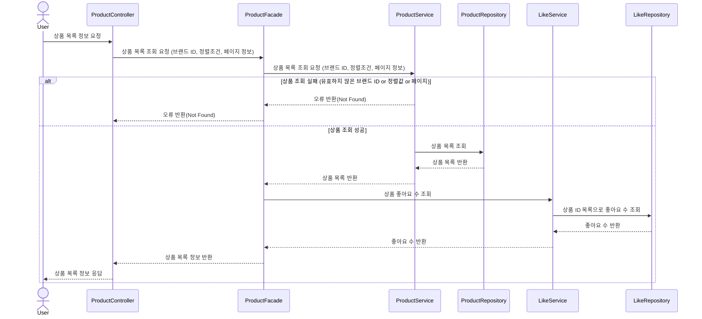
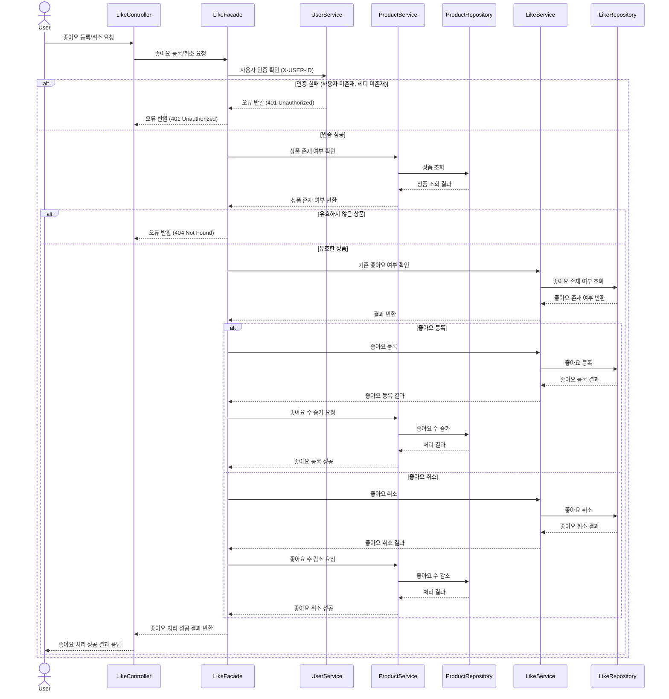
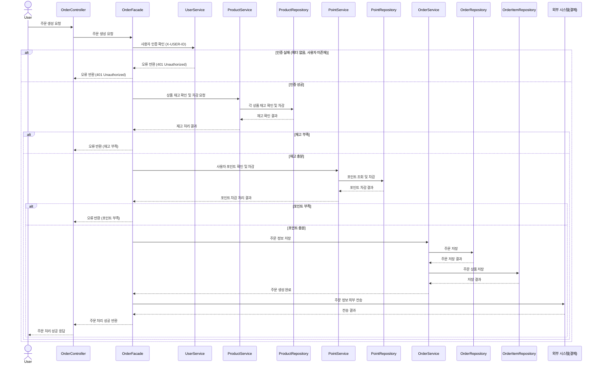

# 시퀀스 다이어그램

---

## 1. 상품 목록

```mermaid
sequenceDiagram
    actor User
    participant ProductController
    participant ProductFacade
    participant ProductService
    participant ProductRepository
    participant LikeService
    participant LikeRepository

    User->>ProductController: 상품 목록 정보 요청
    ProductController->>ProductFacade: 상품 목록 조회 요청 (브랜드 ID, 정렬조건, 페이지 정보)
    ProductFacade->>ProductService:  상품 목록 조회 요청 (브랜드 ID, 정렬조건, 페이지 정보)
    
    alt 상품 조회 실패 (유효하지 않은 브랜드 ID or 정렬값 or 페이지)
        ProductService-->>ProductFacade: 오류 반환(Not Found)
        ProductFacade-->>ProductController: 오류 반환(Not Found)
    else 상품 조회 성공
        ProductService->>ProductRepository: 상품 목록 조회
        ProductRepository-->>ProductService: 상품 목록 반환
        ProductService-->>ProductFacade: 상품 목록 반환

        ProductFacade->>LikeService: 상품 좋아요 수 조회
        LikeService->>LikeRepository: 상품 ID 목록으로 좋아요 수 조회
        LikeRepository-->>LikeService: 좋아요 수 반환
        LikeService-->>ProductFacade: 좋아요 수 반환

        ProductFacade-->>ProductController: 상품 목록 정보 반환
        ProductController-->>User: 상품 목록 정보 응답
    end
```

## 2.상품 좋아요 등록/취소

```mermaid
sequenceDiagram
    actor User
    participant LikeController
    participant LikeFacade
    participant UserService
    participant ProductService
    participant ProductRepository
    participant LikeService
    participant LikeRepository

    User->>LikeController: 좋아요 등록/취소 요청
    LikeController->>LikeFacade: 좋아요 등록/취소 요청
    LikeFacade->>UserService: 사용자 인증 확인 (X-USER-ID)

    alt 인증 실패 (사용자 미존재, 헤더 미존재)
        UserService-->>LikeFacade: 오류 반환 (401 Unauthorized)
        LikeFacade-->>LikeController: 오류 반환 (401 Unauthorized)
    else 인증 성공
        LikeFacade->>ProductService: 상품 존재 여부 확인
        ProductService->>ProductRepository: 상품 조회
        ProductRepository-->>ProductService: 상품 조회 결과
        ProductService-->>LikeFacade: 상품 존재 여부 반환

        alt 유효하지 않은 상품
            LikeFacade-->>LikeController: 오류 반환 (404 Not Found)
        else 유효한 상품
            LikeFacade->>LikeService: 기존 좋아요 여부 확인
            LikeService->>LikeRepository: 좋아요 존재 여부 조회
            LikeRepository-->>LikeService: 좋아요 존재 여부 반환
            LikeService-->>LikeFacade: 결과 반환

            alt 좋아요 등록
                LikeFacade->>LikeService: 좋아요 등록
                LikeService->>LikeRepository: 좋아요 등록
                LikeRepository-->>LikeService: 좋아요 등록 결과
                LikeService-->>LikeFacade: 좋아요 등록 결과
                LikeFacade->>ProductService: 좋아요 수 증가 요청
                ProductService->>ProductRepository: 좋아요 수 증가
                ProductRepository-->>ProductService: 처리 결과
                ProductService-->>LikeFacade: 좋아요 등록 성공
            else 좋아요 취소
                LikeFacade->>LikeService: 좋아요 취소
                LikeService->>LikeRepository: 좋아요 취소
                LikeRepository-->>LikeService: 좋아요 취소 결과
                LikeService-->>LikeFacade: 좋아요 취소 결과
                LikeFacade->>ProductService: 좋아요 수 감소 요청
                ProductService->>ProductRepository: 좋아요 수 감소
                ProductRepository-->>ProductService: 처리 결과
                ProductService-->>LikeFacade: 좋아요 취소 성공
            end
            LikeFacade-->>LikeController: 좋아요 처리 성공 결과 반환
            LikeController-->>User: 좋아요 처리 성공 결과 응답
        end
    end
```

---

## 3. 주문 생성 및 결제 흐름

```mermaid
sequenceDiagram
    actor User
    participant OrderController
    participant OrderFacade
    participant UserService
    participant ProductService
    participant ProductRepository
    participant PointService
    participant PointRepository
    participant OrderService
    participant OrderRepository
    participant OrderItemRepository
    participant PG as 외부 시스템(결제)

    User->>OrderController: 주문 생성 요청
    OrderController->>OrderFacade: 주문 생성 요청
    OrderFacade->>UserService: 사용자 인증 확인 (X-USER-ID)

    alt 인증 실패 (헤더 없음, 사용자 미존재)
        UserService-->>OrderFacade: 오류 반환 (401 Unauthorized)
        OrderFacade-->>OrderController: 오류 반환 (401 Unauthorized)
    else 인증 성공
        OrderFacade->>ProductService: 상품 재고 확인 및 차감 요청
        ProductService->>ProductRepository: 각 상품 재고 확인 및 차감
        ProductRepository-->>ProductService: 재고 확인 결과
        ProductService-->>OrderFacade: 재고 처리 결과

        alt 재고 부족
            OrderFacade-->>OrderController: 오류 반환 (재고 부족)
        else 재고 충분
            OrderFacade->>PointService: 사용자 포인트 확인 및 차감
            PointService->>PointRepository: 포인트 조회 및 차감
            PointRepository-->>PointService: 포인트 차감 결과
            PointService-->>OrderFacade: 포인트 차감 처리 결과

            alt 포인트 부족
                OrderFacade-->>OrderController: 오류 반환 (포인트 부족)
            else 포인트 충분
                OrderFacade->>OrderService: 주문 정보 저장
                OrderService->>OrderRepository: 주문 저장
                OrderRepository-->>OrderService: 주문 저장 결과
                OrderService->>OrderItemRepository: 주문 상품 저장
                OrderItemRepository-->>OrderService: 저장 결과
                OrderService-->>OrderFacade: 주문 생성 완료

                OrderFacade->>PG: 주문 정보 외부 전송
                PG-->>OrderFacade: 전송 결과

                OrderFacade-->>OrderController: 주문 처리 성공 반환
                OrderController-->>User: 주문 처리 성공 응답
            end
        end
    end

```