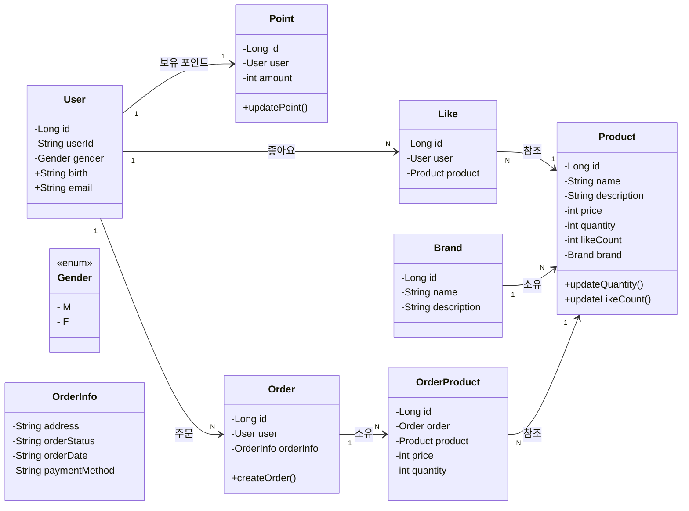

# 클래스 다이어그램

---

```mermaid
classDiagram
    direction LR
    
    class User {
        -Long id
        -String userId
        -Gender gender
        +String birth
        +String email
    }

    class Point {
        -Long id
        -User user
        -int amount
        +updatePoint()
    }

    class Product {
        -Long id
        -String name
        -String description
        -int price
        -int quantity
        -int likeCount
        -Brand brand
        +updateQuantity()
        +updateLikeCount()
    }

    class Like {
        -Long id
        -User user
        -Product product
    }
    
    class Brand {
        -Long id
        -String name
        -String description
    }
    
    class Order {
        -Long id
        -User user
        -OrderInfo orderInfo
        +createOrder()
    }
    
    class OrderProduct {
        -Long id
        -Order order
        -Product product
        -int price
        -int quantity
    }


    %% --- VO ---
    class Gender {
        <<enum>>
        - M
        - F
    }
    
    class OrderInfo {
        -String address
        -String orderStatus
        -String orderDate
        -String paymentMethod
    }
    
    User "1" --> "1" Point : 보유 포인트
    User "1" --> "N" Like : 좋아요
    User "1" --> "N" Order : 주문
    Like "N" --> "1" Product: 참조
    Brand "1" --> "N" Product : 소유
    Order "1" --> "N" OrderProduct: 소유
    OrderProduct "N" --> "1" Product: 참조
    
```