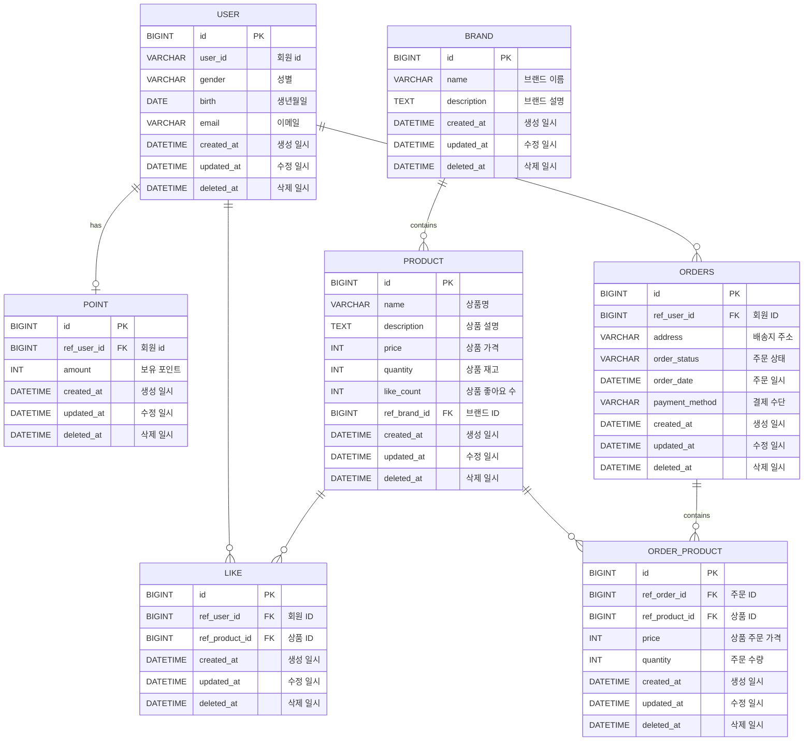

# ERD
---

```mermaid
erDiagram

    USER {
        BIGINT id PK
        VARCHAR user_id "회원 id"
        VARCHAR gender "성별"
        DATE birth "생년월일"
        VARCHAR email "이메일"
        DATETIME created_at "생성 일시"
        DATETIME updated_at "수정 일시"
        DATETIME deleted_at "삭제 일시"
    }

    POINT {
        BIGINT id PK
        BIGINT ref_user_id FK "회원 id"
        INT amount "보유 포인트"
        DATETIME created_at "생성 일시"
        DATETIME updated_at "수정 일시"
        DATETIME deleted_at "삭제 일시"
    }

    BRAND {
        BIGINT id PK
        VARCHAR name "브랜드 이름"
        TEXT description "브랜드 설명"
        DATETIME created_at "생성 일시"
        DATETIME updated_at "수정 일시"
        DATETIME deleted_at "삭제 일시"
    }

    PRODUCT {
        BIGINT id PK
        VARCHAR name "상품명"
        TEXT description "상품 설명"
        INT price "상품 가격"
        INT quantity "상품 재고"
        INT like_count "상품 좋아요 수"
        BIGINT ref_brand_id FK "브랜드 ID"
        DATETIME created_at "생성 일시"
        DATETIME updated_at "수정 일시"
        DATETIME deleted_at "삭제 일시"
    }

    "LIKE" {
        BIGINT id PK
        BIGINT ref_user_id FK "회원 ID"
        BIGINT ref_product_id FK "상품 ID"
        DATETIME created_at "생성 일시"
        DATETIME updated_at "수정 일시"
        DATETIME deleted_at "삭제 일시"
    }

    ORDERS {
        BIGINT id PK
        BIGINT ref_user_id FK "회원 ID"
        VARCHAR address "배송지 주소"
        VARCHAR order_status "주문 상태"
        DATETIME order_date "주문 일시"
        VARCHAR payment_method "결제 수단"
        DATETIME created_at "생성 일시"
        DATETIME updated_at "수정 일시"
        DATETIME deleted_at "삭제 일시"
    }

    ORDER_PRODUCT {
        BIGINT id PK
        BIGINT ref_order_id FK "주문 ID"
        BIGINT ref_product_id FK "상품 ID"
        INT price "상품 주문 가격"
        INT quantity "주문 수량"
        DATETIME created_at "생성 일시"
        DATETIME updated_at "수정 일시"
        DATETIME deleted_at "삭제 일시"
    }

%% 관계 정의
    USER ||--o| POINT: "has"
    USER ||--o{ LIKE: ""
    USER ||--o{ ORDERS: ""
    BRAND ||--o{ PRODUCT: "contains"
    PRODUCT ||--o{ LIKE: ""
    PRODUCT ||--o{ ORDER_PRODUCT: ""
    ORDERS ||--o{ ORDER_PRODUCT: "contains"

```